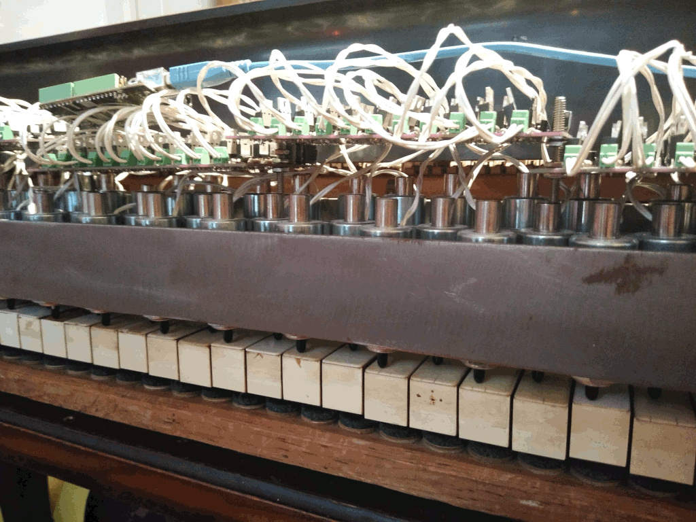

# CML picadae hardware and a control files.

- [__kicad__](kicad/README.md) contains the keyboard and pedal schematics and printed circuit board layout.
- [__control__](control/README.md) contains the keyboard solenoid ATtiny85 firware, controller Arduino firmware and, Python control API and program.

