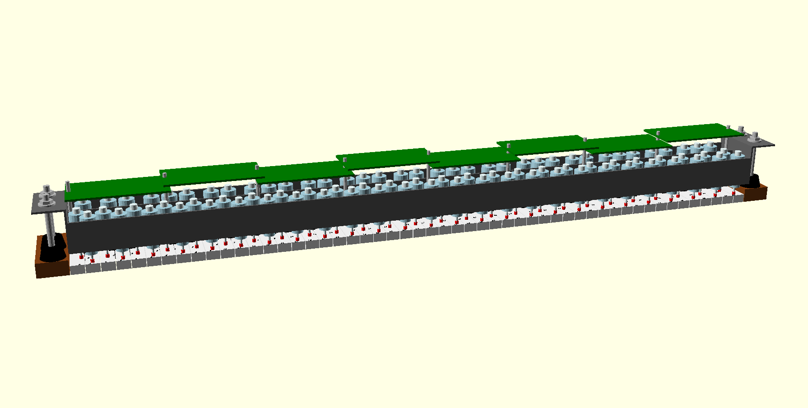

# Bill of materials

## Keyboard Power and Control 

These parts serve the entire keyboard solenoid assembly.

Id   | Type            | Description          | Qty | Source   | Part Number
-----|-----------------|----------------------|-----|----------|--------------------
J3   | 6P Terminal     | Screw Terminal       |   2 | Mouser   | 651-1725698
P1   | HDS800PS24      | 24V Power Supply     |   1 | Digikey  | 1470-2689-ND
P2   | HDS800PS12      | 12V Power Supply     |   1 | Digikey  | 1470-2687-ND
P3   | TXL 015-05S     | 5V Power Supply      |   1 | Digikey  | 1951-1325-ND
M0   | Controller MCU  | Arduino Uno R3       |   1 | Digikey  | 1050-1024-ND
None | 1/16 x 1/8 x 1/2| Rubber feet(pkg 100) |   1 | McMaster | 9753K11

## Key Driver Board (11 channels per board) 

There are 8 driver boards per keyboard solenoid assembly. Each board
has 11 driver circuits.  

Id   | Type            | Description         | Qty | Source   | Part Number
-----|-----------------|---------------------|-----|----------|--------------------
U1   | ATtiny85-20MU   | Microcontroller     |  11 | Mouser   | 556-ATTINY85-20PU
None | 8DIP IC         | Socket              |  11 | Mouser   | 571-1-2199298-2
None | 0.1uF           | Capacitor           |   1 | Digikey  | 399-14010-1-ND
R1-2 | 4.7k            | Resistor            |  22 | Mouser   | 293-4.7K-RC
D1   | BYV32-200       | Diode               |  11 | Mouser   | BYV32-200GOS-ND
D2   | SF52            | Rectifier           |  11 | Mouser   | 583-SF52-B
D4   | Z10Y            | Diode               |  11 | Mouser   | 78-BZX55C10-TAP
Q1   | 2N3906          | BJT                 |  11 | Mouser   | 512-2N3906BU
Q2   | IRL640          | MOSFET              |  11 | Mouser   | 512-IRL640A
Q3   | IRF610          | MOSFET              |  11 | Mouser   | 844-IRF610PBF
S1   | Solenoid        | Ledex 195207-228    |  11 | Testco   | 195207-228
C1   | 100uF           | Capacitor           |   2 | Digikey  | 493-1668-ND
J1   | 2P Terminal     | Screw Terminal      |  11 | Mouser   | 651-1725656
J2   | 6P Female .1    | Pin Terminal        |   1 | Digikey  | H123900-ND

## Damper Pedal Driver Board

Id   | Type            | Description         | Qty | Source   | Part Number
-----|-----------------|---------------------|-----|----------|--------------------
R1-4 | 180 ohm         | Resistor            |   4 |  Mouser  | 660-MF1/2LCT52R181G
R5-6 | 470 ohm         | Resistor            |   2 |  Mouser  | 71-CCF07470RGKE36
C1-2 | 1uF             | Capacitor           |   2 |  Newark  | 65R3171
C3-4 | 4700uF          | Capacitor           |   2 |  Newark  | GBPC2501W
Q1-2 | BS170           | MOSFET              |   2 |  Mouser  | 512-BS170
Q3-4 | IRF1310NPBF     | MOSFET              |   2 |  Mouser  | 942-IRF1310NPBF
U1   | TLP523          | Dual Opto-isolator  |   1 |  Newark  | 05M1443
U2-3 | LM7810ACT       | 10V Voltage Regulato|   2 |  Mouser  | 512-KA7810ETU
D1   | Bridge Rectifier| 100V 25A            |   1 |  Newark  | GBPC2501W
D2-3 | STTH30R061PI    | Diode               |   1 |  Mouser  | 512-RURP3060
L1   | Push Solenoid   | 24 Volt             |   1 |  Laukhuff| 301010
T1   | Transformer     |                     |   1 |  Digikey | 595-1961-ND
